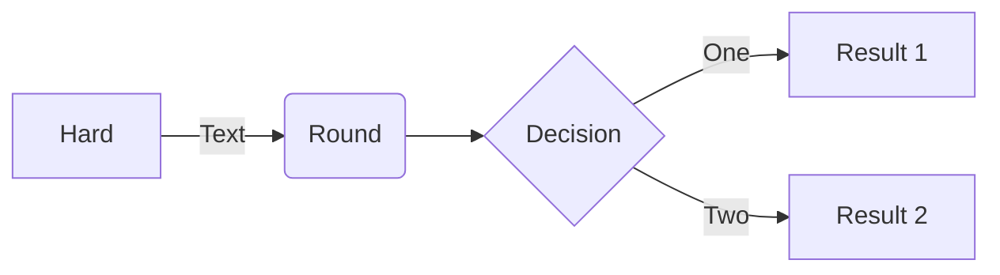

This is a test post!


## header


{: width="355.5" height="301.1" }
_This is a cat_

> Example line for prompt.
{: .prompt-warning }

`inline code`

```py
print("hello wrold!")
```
{: file="/home/sup.py" }

$$
\frac{x}{y} = omg + \int_{h}^{i} / \alpha
$$


## cool flowchart

flowchart LR



## bye