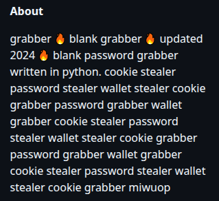

# Keywords
The following keywords can be used in GitHub's search feature to reliably find malicious repositories:
- `Discord image logger`
- `BlackCap-Grabber`
- `Red tiger`
- `Fortnite cheat`
- `Roblox executor`
- `Token grabber`
- `Creal stealer`
- `Blank grabber`
- `Casino predictor`

# Identification
How to identify if a repository as malware:
- Recent creation date
- 50-200 stars
- About 100 forks
- Most stargazers accounts were all created on one day

- Long "About" section repeating words multiple times

- No actual code, only a README and an .exe
- There's different ways threat actors can hide the actual malicious code. One very common way is to use the "semicolon trick", where malicious commands are placed in a line after a lot of spaces. You can recognize this by looking at the size of the horizontal scrollbar on GitHub.

Another way is using a malicious Visual Studio .suo (Solution user options) file which gets executed when you open up the Visual Studio Project on your machine. Use [this tool](https://github.com/drewnoakes/suo) if you want to inspect suspicious .suo files. More info on this particular exploitation technique can be found [here](https://github.com/mitjakolsek/EvilSln).
- Ask GitHub Copilot to explain you the code
- Upload file(s) to [VirusTotal](https://virustotal.com) or analyze their behaviour using [any.run](https://any.run) or [tria.ge](https://tria.ge)
- If you're curious, you can take a look at the code and try to decode it and get the C2 URL (but please in a virtual machine!)

# Recommended Actions
- Report it to GitHub 
- Leave an issue telling people "this is malware"
- Report C2 URLs to Google Safe Browsing, 
- Delete Discord webhooks being used as C2 using the [Webhook Deleter](https://webhook-deleter.netlify.app/) if there are any

# Conclusion
GitHub should scan more aggressively for malware. There are a lot of potential indicators to identify malicious repositories. Reports take too long to process, repos are still up for weeks after reporting them.
But, I'm going to be honest with you: I don't think anything is going to change in the near future. Microsoft is too busy integrating AI into everything, so they have no time fixing the actual issues.